# Agentic PMS — changes, 22–23 September 2026

**Period:** 22 Sep 2026 07:19 → 23 Sep 2026 09:02
**Commits:** 31 · **Files changed:** 92 · **+7,860 / −469 lines**
**Deployed:** yes — production is on `3c9bfcc`, verified on the instance
**Repository:** `shreynigam63/Mindgate-PMS`, branch `claude/push-code-github-2rhnnq`, merged to `main`

Every screenshot in this document was captured from the running build, not
drawn. Every number was read from the database or the live API, not
estimated.

---

## 1. What shipped, in one table

| # | Change | Where you see it | Written up in |
|---|---|---|---|
| 1 | End-to-end testing guide, published as a PDF | `docs/` | — |
| 2 | Quarterly Connects moved between My Growth and Mid-Year | nav | — |
| 3 | Change log for 17–22 Sep, published as a PDF | `docs/` | — |
| 4 | Clickable UI prototype, two navigation variants | `docs/prototype/` | §2 |
| 5 | Product named in full; the HRMS menu dropped to Dashboard only | header | §2 |
| 6 | Shell switched from a left sidebar to **role tabs** | every page | §2 |
| 7 | One **hero band** per page instead of 29 hand-rolled header rows | every page | §2 |
| 8 | Menu gated on `core.page_permission`, not a hardcoded role list | every page | §2, §4 |
| 9 | **All Approvals** — every pending decision in one queue | HR Admin | §2 |
| 10 | Manager **potential rating** recorded at evaluation, not only calibration | Team Evaluation, Calibration | §7 |
| 11 | One shared **search control**, added to eleven lists | eleven pages | §2 |
| 12 | **Status tabs** — pending split from approved; null-employee queue bug fixed | Team KRA Sheets | §2, §7 |
| 13 | 31-point tracker as a working `.xlsx` | `docs/` | — |
| 14 | **Home dashboard** — lands on what you owe, not on My KRAs | Home | §3 |
| 15 | Dashboard rebuilt to your HRMS reference: stat strip + desk tiles | Home | §3 |
| 16 | Every role tab coloured; icon badge on every dashboard block | every page | §2, §3 |
| 17 | **Fix:** a KRA shelf published under a department was invisible | My KRAs | §7 |
| 18 | **Department** on the Career Pathing Matrix, end to end | HR Admin | §7 |
| 19 | **Fix:** an employee could see the HR Admin tab | every page | §4 |
| 20 | KRA Library clubbed by parameter | KRA Library | §5 |
| 21 | Auto-mail on every submission to a manager or above | — | §6 |
| 22 | Requests visible on both dashboards | Home | §4 |
| 23 | **One KRA table:** Parameters · KRAs · KPIs · Weightage | KRA Library, My KRAs, manager review | §5 |

---

## 2. The interface

This is the change you see before any other, and the one this document
under-reported in its first version: four one-line rows in the table above
with no section and no screenshots. It is written out properly here.

### The shell: a left sidebar became role tabs

The 29-item left sidebar was replaced by four **role tabs** across the top,
each opening its own row of pages. Every tab carries its group's colour —
tinted when closed, fully saturated when open — and its own icon, so the row
reads as four places rather than one live tab and three dead ones.

Which tabs you get is decided by `core.page_permission`, not a hardcoded role
list, and an empty group disappears rather than opening onto nothing.

**Employee — 2 tabs: My Performance, Engagement & People**

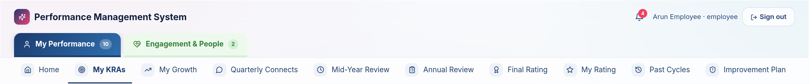

**Manager — 3 tabs, + Team**

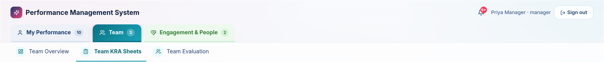

**HR / Admin — 4 tabs, + HR Admin. Fifteen pages, wrapped onto two rows**

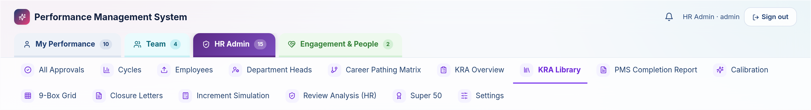

HR Admin's fifteen pages need 2,286px at a 1,440px window. The sub-nav
therefore **wraps** rather than scrolling sideways — measured, not guessed. A
scrolling row hid eight of HR's pages off the right edge with no cue they
existed, which would have been worse than the sidebar it replaced on exactly
the axis the sidebar was good at.

The layout was built **both ways first** — a left-sidebar variant and a
role-tab variant, from one generator — so the choice was made by looking at
them rather than by argument, and the round trip back to a sidebar was proven
to work before committing to tabs.

### One hero band instead of 29 header rows

Every page had hand-rolled its own title row. There is now one `PageHead`
component: a coloured band carrying the title, a subtitle and whatever chips
or buttons the page needs. It takes a hue, so a page announces which group it
belongs to before you have read the title — navy for My Performance, teal for
Team, violet for HR Admin, green for Engagement & People.

### One search control, on eleven lists

Lists that ran to hundreds of rows had no way to find anything. `SearchBox`
is one control with one behaviour, added to eleven of them — and it hides
itself when the list is empty, rather than offering to search nothing.

### Status tabs

`StatusTabs` replaces "a count in the header and one long list". A manager's
Team KRA Sheets page now opens on **Pending your review**, with Approved,
Returned and Not submitted beside it. Tabs with a count of zero are hidden.
Before this, an approved sheet looked identical to one nobody had touched
until you opened it.

**The role tabs, the hero band, the status tabs and the search control, together on one page**

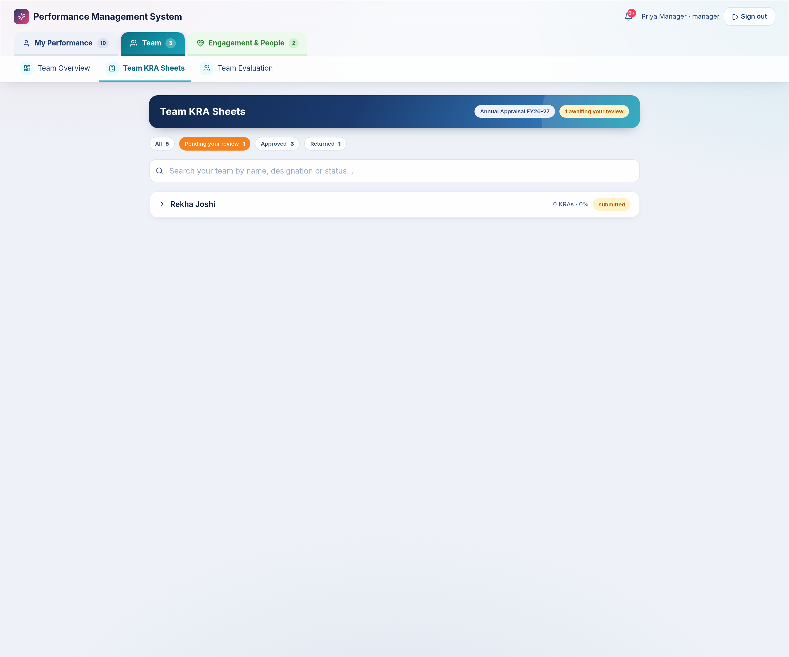

### All Approvals

A single queue of every pending decision in the company, for HR. Two kinds of
row, and the page is honest about the difference: a KRA sheet or a growth plan
has been *submitted* and gets an Approve button; a mid-year sign-off or an
evaluation is waiting on somebody to *write* something, so those rows show who
they are waiting on and nothing else. Offering an Approve button there would
mean writing an empty evaluation in someone else's name.

**All Approvals — every pending decision in the company**

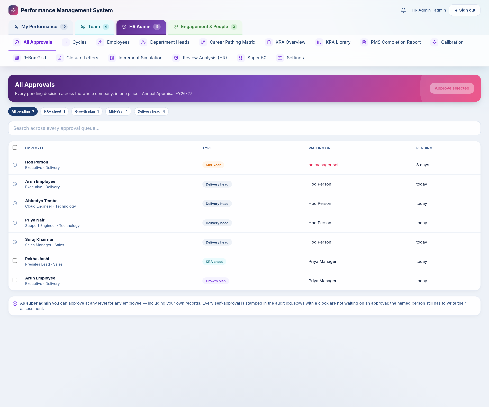

**Calibration — a hero in a different hue, on a dense table page**

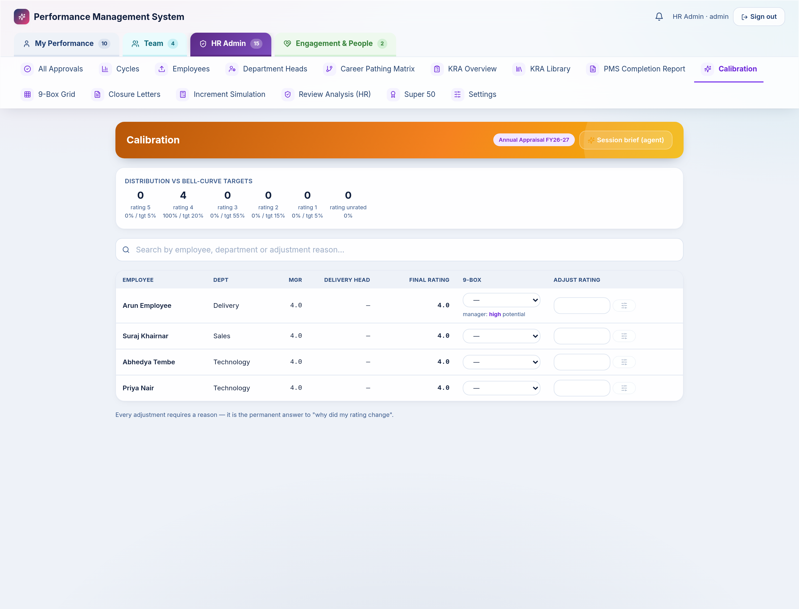

### The palette

Sampled from the client's own reference screenshots rather than invented:
navy `#1b3b6f`, pink `#ec407a`, teal `#17a2b8`, amber `#f5821f`, green
`#43a047`, plus violet for HR and AI surfaces. Pink is **no longer** the
active-nav colour — the active item is coloured by its group instead, which
is what tells you where you are in a 29-item menu; one accent colour could
not carry that.

---

## 3. The dashboard

Signing in used to drop you onto My KRAs whatever the cycle was doing and
whatever you owed. It now lands on a dashboard built to the Humanware
reference you sent: a strip of stat cards, a single action banner, solid
colour "desk" tiles for what is outstanding, then quick links.

**Every number is a real count.** There is no filler tile. New queries back
the figures that did not exist: growth goals, connects logged, open connect
action items, reports with no 1-on-1, and KRA sheets submitted but undecided.

**A tile only exists when its count does.** Your reference shows six tiles
even when four read `00`; this does not, because a wall of zeroes trains
people to stop reading the row.

**HR / Super Admin**

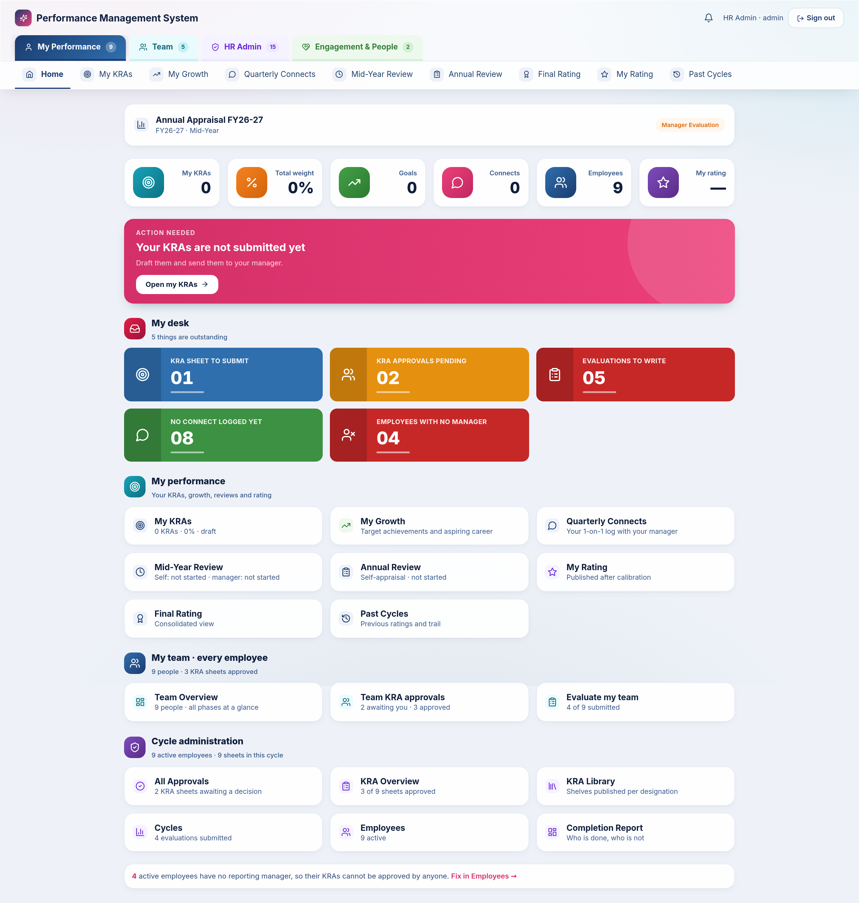

**Manager**

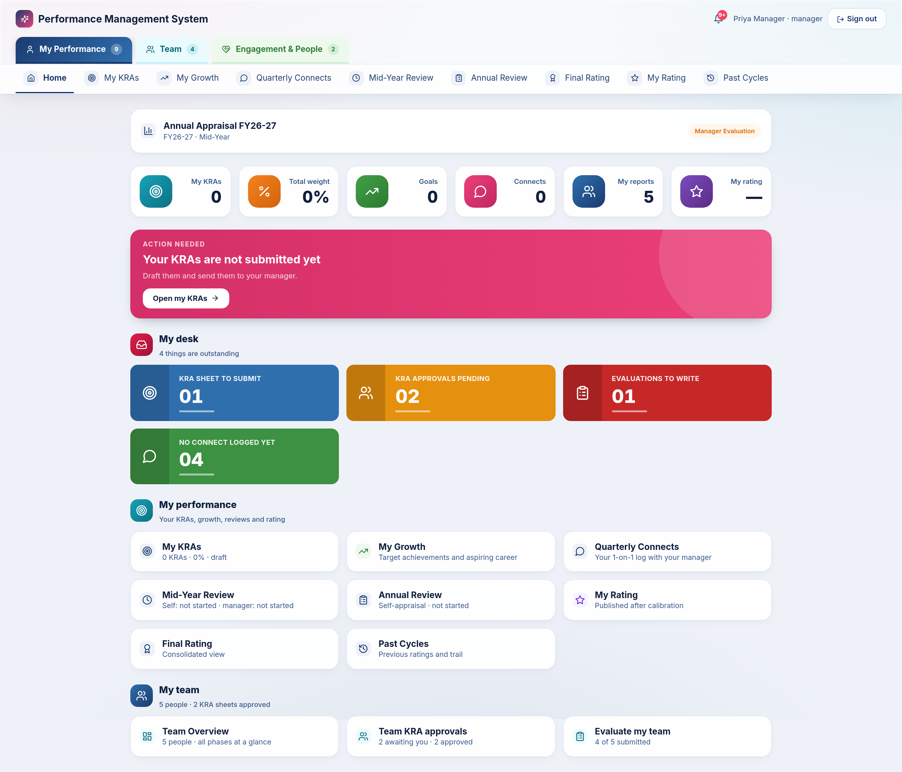

**Employee**

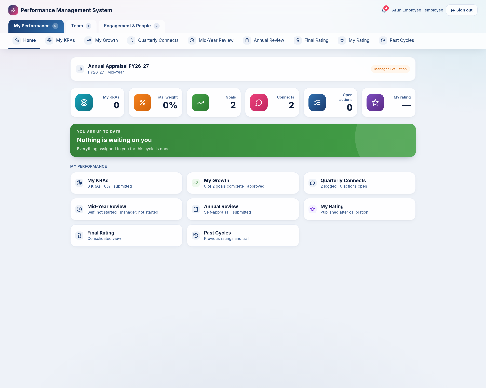

### Two bugs this turned up

1. **A brand-new employee was told "Nothing is waiting on you."** The
   guard required a `pms.kra_sheets` row to exist, so someone who had never
   opened the product fell through every branch to the all-clear. The one
   person who most needs telling was the one not told.
2. **In manager evaluation the KRA queue is empty** (sheets are approved by
   then), so a manager owing an assessment for every report got the same
   all-clear. It now says "3 evaluations to write".

Both have regression tests, and each bug was put back to confirm the test
fails against it before the test was trusted.

---

## 4. Access: an employee could see the HR Admin tab

**This was a live fault, not a preference.** The sign-in path stored the user
object from the *login* response, which carries no `pages` field, and the nav
reads a missing `pages` as "this tenant has not configured page permissions —
show everything". That is the deliberate fallback for an unconfigured tenant,
and it fired for everyone. For the whole of a first session **every role saw
every tab**. It corrected itself on the next refresh, which is why it went
unnoticed: reloading is the first thing anybody does.

The API always enforced permissions, so no data was exposed — but the menu
was wrong, and a menu that offers HR Admin to an employee is not acceptable.

**The data was never wrong.** Checked on the live tenant before touching any
code: an employee resolves to 12 public pages, none of them HR Admin. Only
the client was wrong. `/me` is now the single way a user object is built, on
a cold load and after sign-in alike, and nothing renders until it answers.

Verified by signing in through the real form as all four roles and comparing
the tabs before and after a refresh:

| Role | Tabs |
|---|---|
| Employee | My Performance · Engagement & People |
| Manager | My Performance · Team · Engagement & People |
| Delivery Head | My Performance · Team · HR Admin (1) · Engagement & People |
| Admin | My Performance · Team · HR Admin (15) · Engagement & People |

**Improvement Plans moved** from Team to My Performance. It was the only item
left in Team for an employee, because it is deliberately public — row-scoped
in the handler, so you see your own plan. Gating it would have taken an
employee's own improvement plan away from them to tidy a tab.

### Requests on both dashboards

A submission is one row that is a **sent request** to the employee and a
**pending request** to their manager. Both ends read the same rows with the
same status tests — the only way the two can agree.

**Employee — "Requested to manager", naming who has it and for how long**

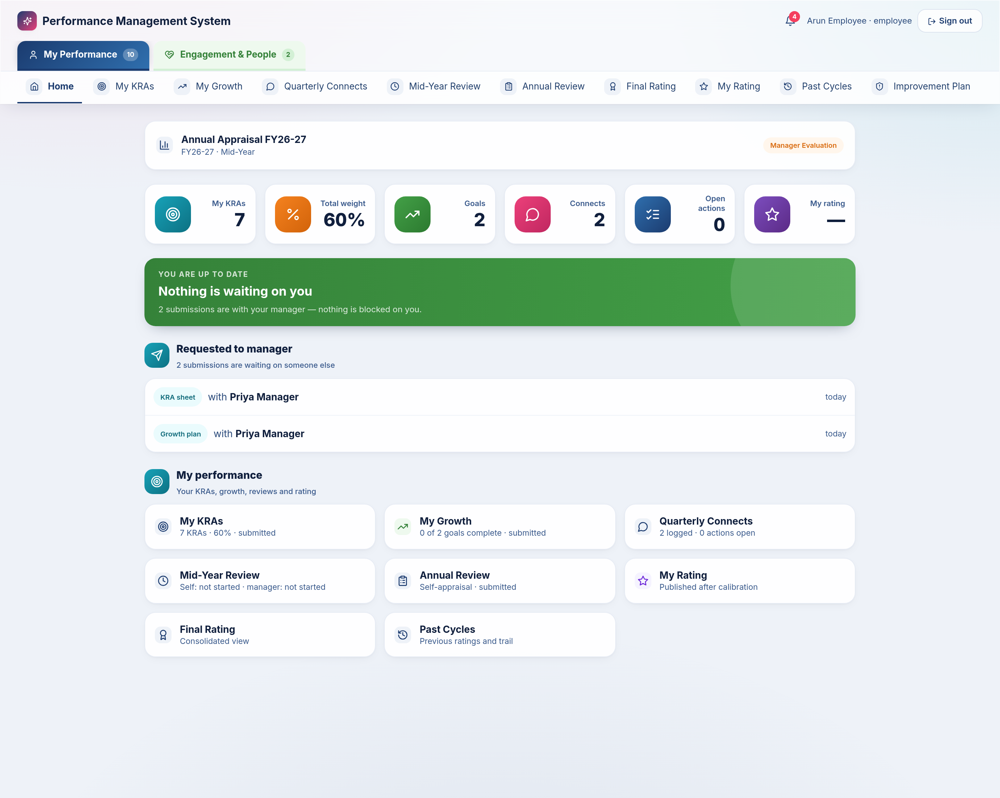

**Manager — a "Pending requests" tile and a breakdown by kind**

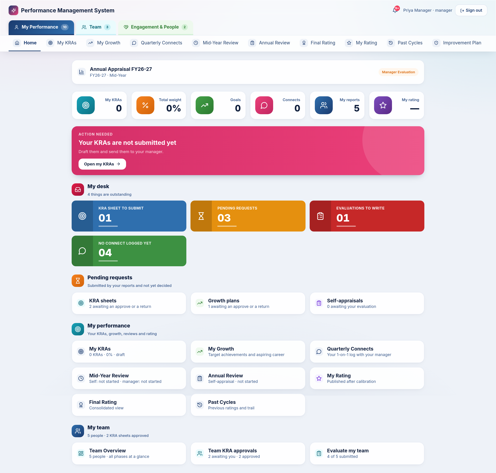

They did **not** agree in the first cut: the manager's count excluded a
self-appraisal that already had a submitted evaluation, the employee's list
did not, so the employee was told their appraisal was still with their
manager days after the manager had finished with it. Fixed, with a test that
names the failure.

---

## 5. The KRA table

Requested format, adopted from your own sheet:

> **Parameters · KRAs · KPIs · Weightage** — KRAs under parameters in a
> single table instead of separate with the same parameter displayed separate.

The parameter is a **merged cell spanning its KRAs**, so it is written once
however many sit under it.

**KRA Library — a published shelf**

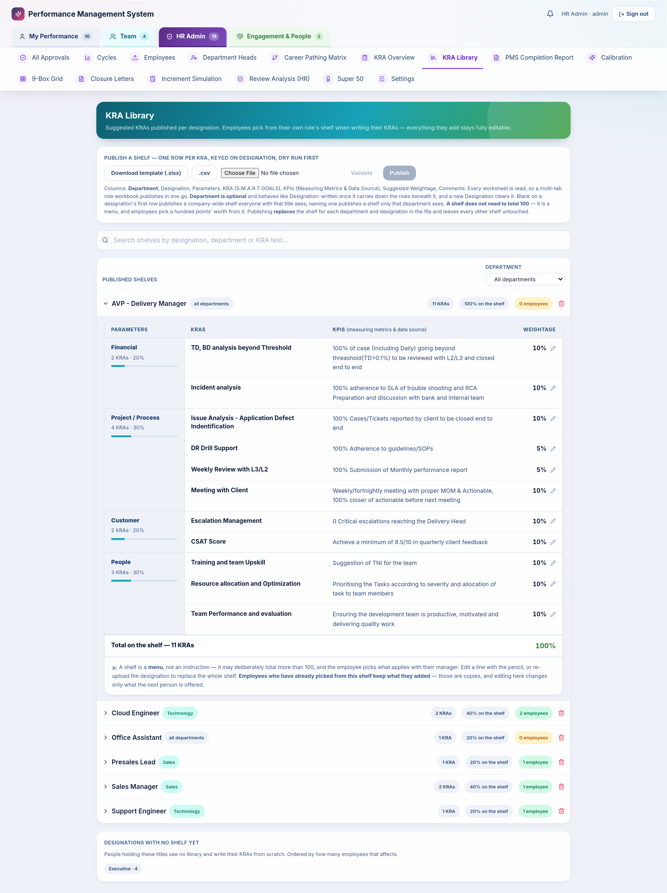

**My KRAs — editable (draft or returned)**

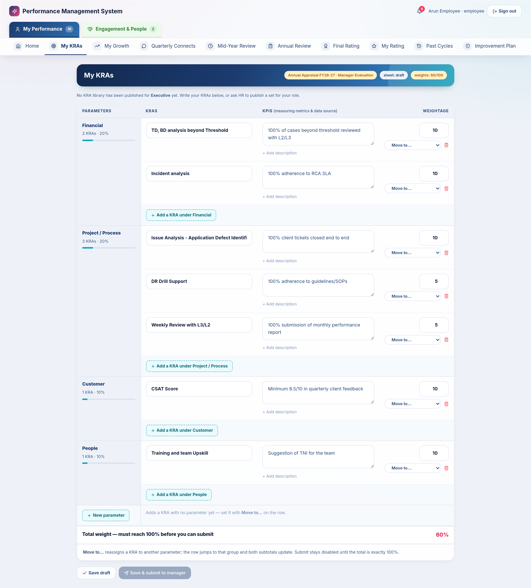

**My KRAs — locked (submitted or approved)**

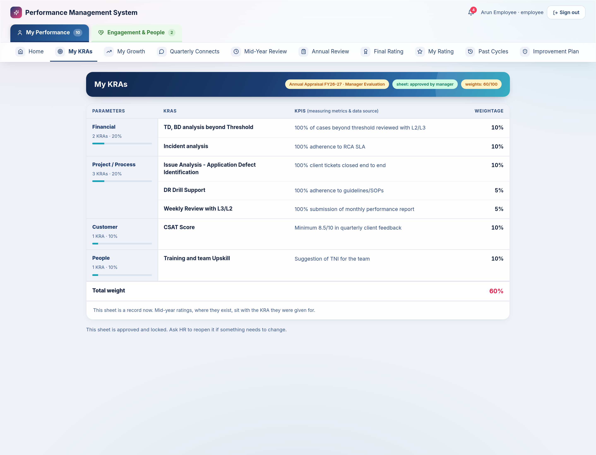

**A manager reviewing the same sheet**

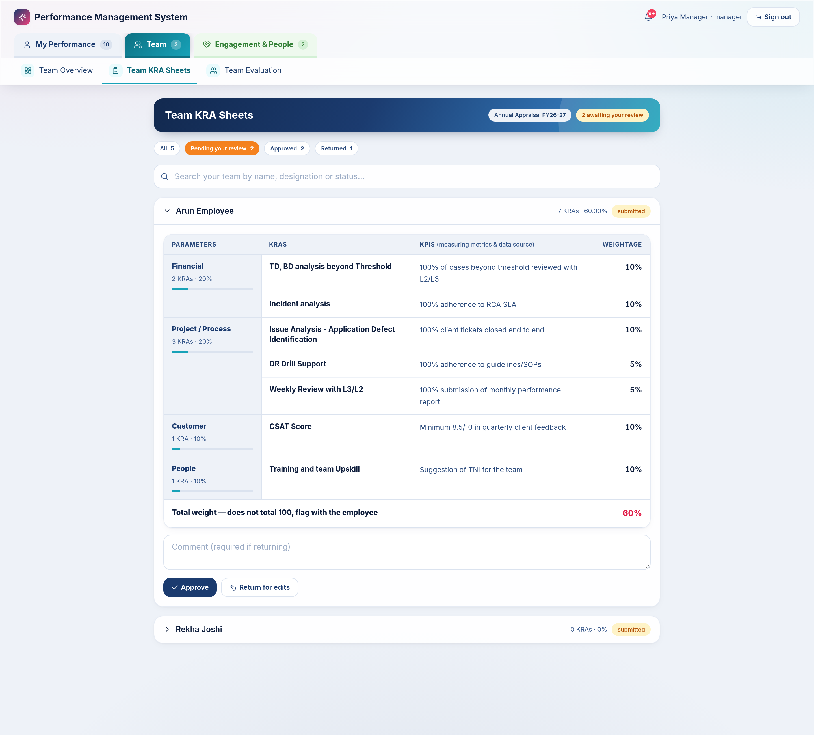

**Phone, 390px — the merged column folds instead of scrolling sideways**

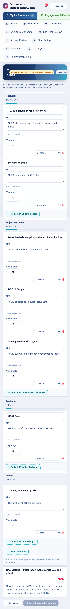

**Four screens, not the two asked for.** The manager's review shows the same
KRAs; leaving it as cards would have broken the format the moment a manager
opened it.

**The editable sheet needed a new control.** With the parameter merged,
changing a KRA's parameter physically moves the row — so the per-row select
became **"Move to…"**. It never displays the current parameter, because the
merged cell already does and repeating it on every row is the exact
duplication this change removes. The current parameter is also left out of
its own options.

**A merged column cannot survive a phone.** Below 720px the table becomes
blocks, which makes `rowSpan` inert, so the parameter is a full-width band
ahead of its KRAs. Measured at 390px: the KRA field is 328px wide and the
page does not scroll sideways. The desktop widths leaked through on the first
attempt and squeezed that field to about eight characters.

**"Measures" is now "KPIs"** wherever a user reads it, matching the column
name the upload template has always used. Labels only, no data change.

---

## 6. Auto-mail on submission

`notify()` takes `{ email: true }`, and the submission and decision events
set it: KRA sheet, growth plan, self-appraisal, mid-year sign-off, and the
approve/return coming back the other way.

**Opt-in, not automatic for every notification.** The in-app bell carries
plenty nobody needs an email about; mailing all of it would train people to
filter the address, and then the submissions would be missed too.

An SMTP provider is wired (nodemailer), reading host/port/user/password from
the tenant's settings first and the environment second — **so it goes live
the moment those exist, with no redeploy.**

> **Currently in simulated mode.** Nothing leaves the machine. Every attempt
> is written to `core.notif_log` with its outcome. Send SMTP details and it
> switches on.

A mail failure never fails the submission: the work is already saved and the
in-app notification already written.

---

## 7. Other fixes worth naming

**A KRA shelf published under a department was invisible.** Reported as
"after changing department and designation, new KRAs were not fetched".
Reproduced, and it was not caching — the server re-reads designation on every
request. Three queries look for a shelf: the department asked for, the
department the employee is in (only when department matching is on), then the
company-wide shelf, which *requires* the department column to be blank. A
library uploaded with departments filled in, on a tenant at the default
scope, had no query that could reach it. The picker then said *"No KRA
library has been published for Cloud Engineer"* while two rows for Cloud
Engineer sat in the table — a false empty state, which is worse than a
missing one: it tells HR their upload did not land.

**Department on the Career Pathing Matrix**, carried end to end rather than
added to the spreadsheet alone. Blank means every department; a named one
applies only there and beats a company-wide rung for the same move.

**Manager potential rating.** Potential was recorded only at calibration,
which is months after the manager who knows the person best has formed a
view. It is now captured with the manager's evaluation as well, and shown on
the calibration screen as the starting point for that conversation — not as
the answer. Calibration still sets the 9-box cell; the two are kept apart so
"why did this change" stays answerable.

**A null employee in the approvals queue.** Two queries read `employee_id`
from the LEFT-JOINed side, so rows arrived with no employee and duplicate
React keys. The filter then showed the wrong rows.

---

## 8. Files

### New React components

| File | What it is |
|---|---|
| `frontend/src/KraTable.jsx` | The one KRA table. Structure here, cells as render props. |
| `frontend/src/PageHead.jsx` | The one page-title band, replacing 29 header rows. |
| `frontend/src/SearchBox.jsx` | One search control + `matches()`, used on eleven lists. |
| `frontend/src/StatusTabs.jsx` | Status tabs + `statusTabs()`, hiding empty tabs. |
| `frontend/src/pages/HomePage.jsx` | The dashboard. |
| `frontend/src/pages/ApprovalsPage.jsx` | All Approvals. |

### React files changed

`App.jsx` (8 commits) · `TeamKraSheetsPage` · `TeamEvalPage` · `KraLibraryPage`
· `HomePage` · `CalibrationPage` · `WatchlistPage` · `PIPPage` · `NineBoxPage`
· `MyKRASheetPage` · `MidYearReviewPage` · `HodQueuePage` · `DepartmentHeadsPage`
· `CompletionReportPage` · `ClosureLettersPage` · `CareerTransitionsPage`
· `ApprovalsPage` · `TeamOverviewPage` · `SettingsPage` · `SelfAppraisalPage`
· `PeopleHubPage` · `ParameterAnalysisPage` · `MyRatingPage` · `MyGrowthPage`
· `KraOrgOverviewPage`

**37 `.jsx` files, +1,532 / −378 lines.**

### Server

| File | Change |
|---|---|
| `server/modules/performance/home.js` | **new** — the dashboard's data in one request |
| `server/modules/performance/approvals.js` | **new** — shared decision + consolidated queue |
| `server/modules/performance/index.js` | `/home`, approvals, email on submission |
| `server/modules/people/index.js` | department on the matrix, `/departments` |
| `server/modules/people/career-transitions-import.js` | Department column |
| `server/core/notifications.js` | opt-in email alongside the in-app bell |
| `server/core/mail.js` | SMTP provider wired, per-tenant settings |
| `server/index.js` | `/me` returns `pages` |

**22 server files, +2,586 / −88 lines.**

### Migrations

| # | What |
|---|---|
| 042 | Seed `core.page_permission` — 31 rows driving nav *and* the URL guard |
| 043 | Manager potential rating on the evaluation |
| 044 | Department on `people.career_transitions` |
| 045 | Declare `core.notif_log` properly |

All four are applied on production — **45 migrations**, verified on the
instance.

### Tests added

| File | Covers |
|---|---|
| `server/test/page-permissions.test.js` | the menu gate and the URL guard read one row |
| `server/test/all-approvals.test.js` | the consolidated queue, incl. the null-employee bug |
| `server/test/potential-rating.test.js` | potential at evaluation and at calibration |
| `server/test/home.test.js` | dashboard scoping, and the two "nothing waiting" bugs |
| `server/test/kra-library-department-only-shelf.test.js` | the invisible shelf |
| `server/test/career-transitions-department.test.js` | Department on the matrix |
| `server/test/requests-and-mail.test.js` | submissions as requests, and the mail |
| `frontend/test/kra-table.test.mjs` | the table format, in a real browser |

---

## 9. Verification

| Check | Result |
|---|---|
| Server tests | **640 pass, 0 fail** (`npm test`, fresh database) |
| Browser tests | **5 pass, 0 fail** (`npm test` in `frontend/`) |
| Frontend build | clean |
| Production commit | `3c9bfcc` |
| Migrations on production | 45 applied, no boot errors |
| Served bundle | hash matches the local build, byte for byte |

Where a test guards a bug, the bug was put back and the test confirmed to
fail against it before being trusted. That was done for: the page-permission
gate, the null employee in the approvals queue, the missing-KRA-row
all-clear, the most-specific-wins rule on career transitions, the row
identity on the transitions importer, the invisible department shelf, and
the merged parameter cell.

---

## 10. Open items — these need you

| # | Item | What I need |
|---|---|---|
| 1 | **SMTP** | Host, port, user, password, From address. Mail is wired and simulated until then. |
| 2 | **KRA library has no departments** | All 2,155 rows on the PoC are company-wide, so changing an employee's department cannot change their KRAs. Re-upload with the Department column filled in, or turn department matching off. |
| 3 | **61 employees have no reporting manager** | Their KRAs cannot be approved by anyone, and their submissions notify nobody. Visible on the HR dashboard now. |
| 4 | **Anthropic API key on production** | Still not rotated, and demonstrably live. |
| 5 | **`agentic-pms-tg-docker` target group** | Unhealthy since the Docker stack was stopped. Deregister or delete? |
| 6 | **The EC2 instance is running** | Say if you want it stopped between sessions. |
| 7 | **Employee and manager logins on production** | Only `hr.admin@mindgate.com` has a password. I can create one of each. |
| 8 | **AI-suggested KRAs** | Proposed and costed (about a day). Needs item 2 to be worth much. |
